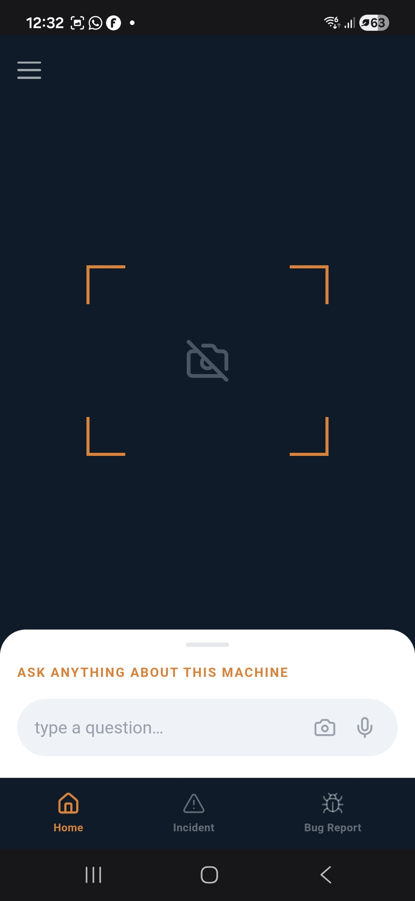
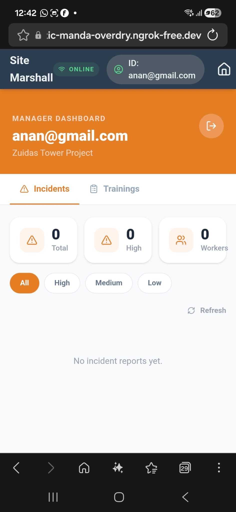
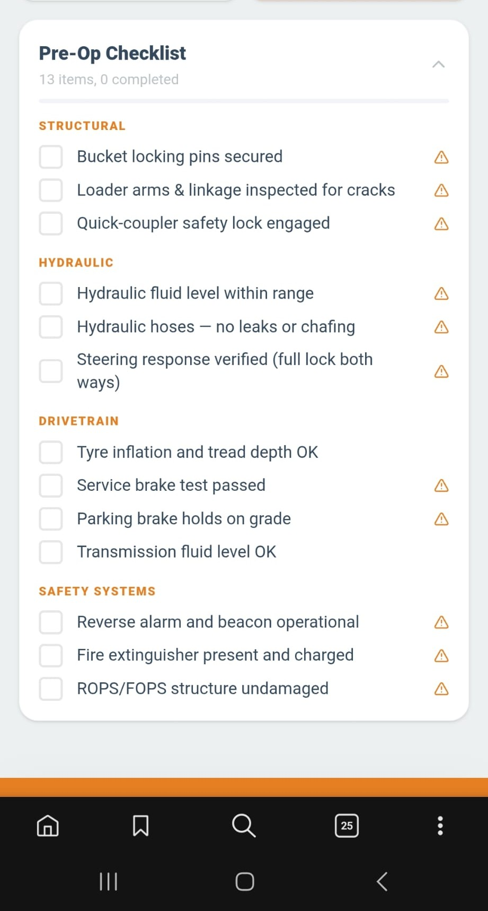
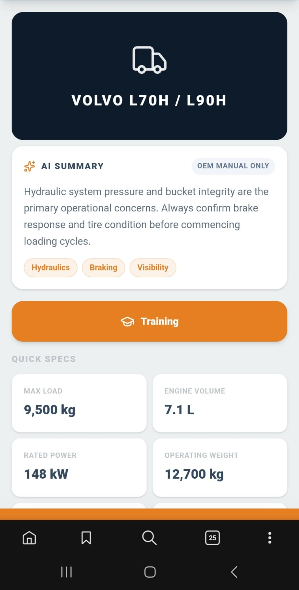
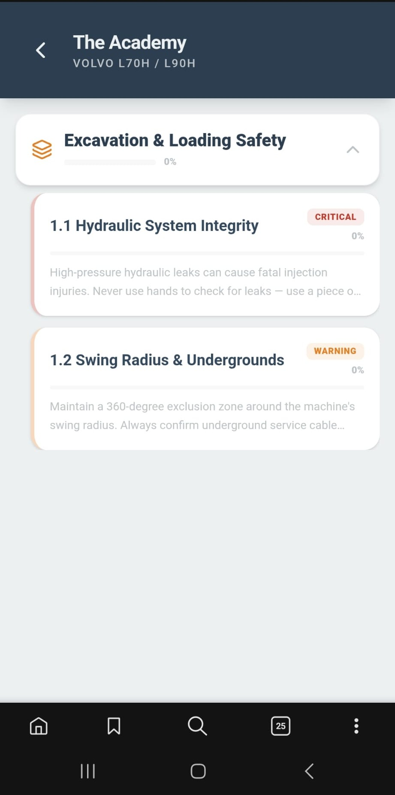
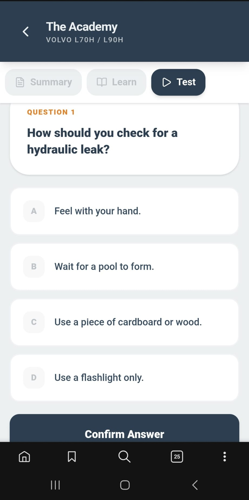
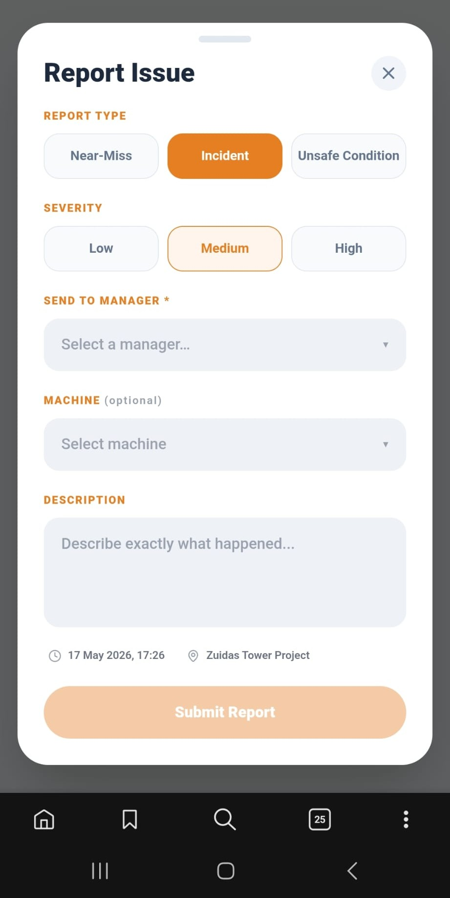
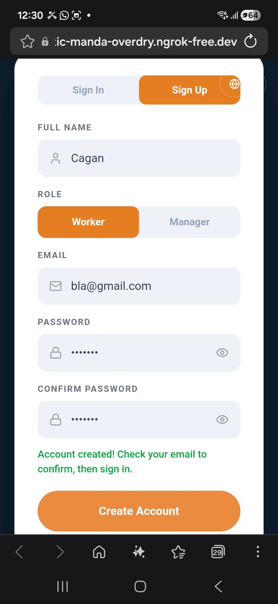
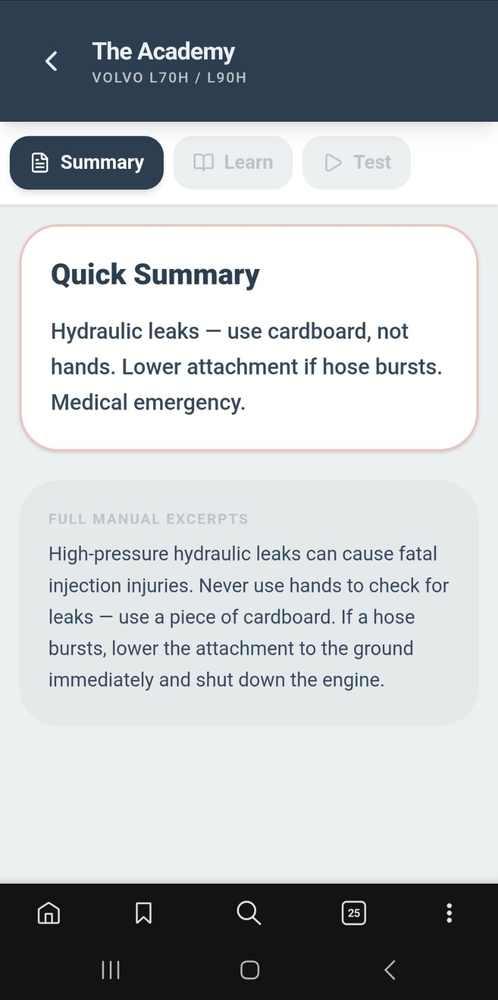

<div align="center">

```
███████╗██╗    ██╗ █████╗  ██████╗
██╔════╝██║    ██║██╔══██╗██╔════╝
███████╗██║ █╗ ██║███████║██║  ███╗
╚════██║██║███╗██║██╔══██║██║   ██║
███████║╚███╔███╔╝██║  ██║╚██████╔╝
╚══════╝ ╚══╝╚══╝ ╚═╝  ╚═╝ ╚═════╝
```

### Safe Walk Augmented Generation
**Multilingual AI safety co-pilot for heavy machinery operators**

<!-- Stack badges -->


<!-- Model badges -->


<!-- Status badges -->


</div>

---

## What It Does

SWAG delivers real-time, context-aware safety guidance to field operators working with heavy machinery. Workers ask questions by **voice or text in their native language** and receive classified safety responses backed by a RAG pipeline over ingested safety manuals.

---

## Safety Tiers

| Tier | Symbol | Meaning |
|------|--------|---------|
| 🔴 **DANGER** | `[ !! ]` | Immediate life-threatening hazard — stop all activity |
| 🟠 **WARNING** | `[ !  ]` | Potential injury risk — proceed with caution |
| 🔵 **INSTRUCTION** | `[  i ]` | Standard operating procedure or informational guidance |

---

## Architecture

```
  [User Input]  voice / text / image
       │
       ▼
  [Whisper STT]  ──────────────────────  raw transcript
       │
       ▼
  [NLLB-200]  ────────────────────────  → English
       │
       ▼
  [ChromaDB RAG]  ─────────────────────  top-k safety chunks
       │
       ▼
  [Claude LLM]  ───────────────────────  grounded response
       │
       ▼
  [Classifier]  ───────────────────────  DANGER / WARNING / INSTRUCTION
       │
       ▼
  [NLLB-200]  ────────────────────────  → operator's language
       │
       ▼
  [gTTS + UI]  ────────────────────────  voice + text output
```
---

## Screenshots

<div align="center">

| Camera / Query | Manager Dashboard | Checklist |
|:-:|:-:|:-:|
|  |  |  |

| Machine Page | Academy | Quiz |
|:-:|:-:|:-:|
|  |  |  |

| Issue Report | Register | Summary |
|:-:|:-:|:-:|
|  |  |  |

</div>

---

## Demo

<div align="center">

)

</div>

---

## Tech Stack

| Layer | Technology |
|-------|-----------|
| **LLM** | Anthropic Claude (answers + translation) |
| **STT** | OpenAI Whisper |
| **Translation** | Meta NLLB-200 (9 languages) |
| **Embeddings** | HuggingFace sentence-transformers |
| **Vector DB** | ChromaDB (persistent) |
| **Object Detection** | YOLO via Roboflow |
| **Video Generation** | Wan 2.2 (Diffusers) |
| **TTS** | Google Gemini Flash TTS |
| **Backend** | Flask 3.0+ + LangChain |
| **Frontend** | React 19 + Tailwind CSS 4 + Vite |
| **Auth / DB** | Supabase |

---

## Quick Start

### 1 — Backend (Flask API)

```bash
pip install -r requirements.txt
python app.py
```

### 2 — Frontend (React PWA)

```bash
cd "Site Marshall"
npm install
npm run dev
```

> Both need to run together. The React frontend calls the Flask API.

### First-time setup

```bash
# Populate the vector database from safety manuals
python init_rag_db.py
```

### Environment

Copy `.env` and fill in your keys:

```
ANTHROPIC_API_KEY=...
OPENAI_API_KEY=...
GOOGLE_API_KEY=...
```

---

## Project Structure

```
SWAG/
├── assets/                  ← README media (screenshots + demo video)
├── pipeline/                ← classifier, director, ingestion
├── swag_db/                 ← ChromaDB vector store (persisted)
├── output/                  ← classified rules (JSON) + manuals (MD)
├── Site Marshall/           ← React + Tailwind frontend (PWA)
├── dataset/                 ← training images
├── weights/                 ← fine-tuned model weights
├── app.py                   ← Flask API entry point
└── init_rag_db.py           ← vector DB initializer
```

---

## License

This project is licensed under the **MIT License**.

---

<div align="center">

Made by [@AtillaErsezen](https://github.com/AtillaErsezen)

</div>
