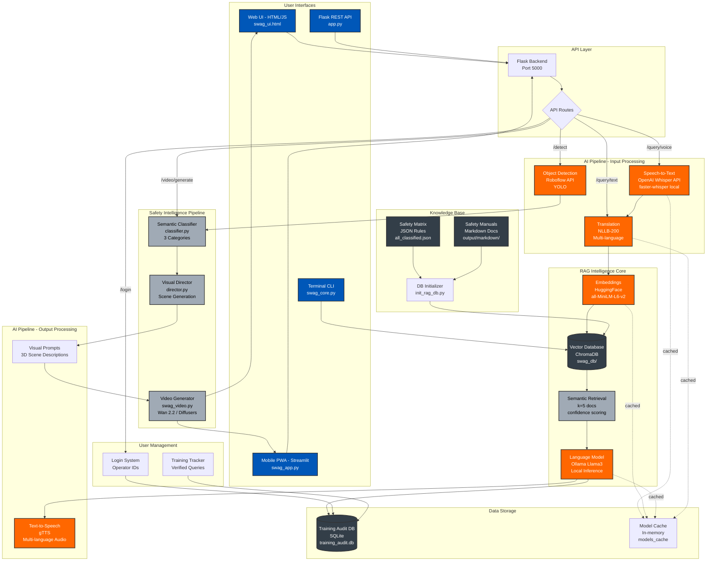
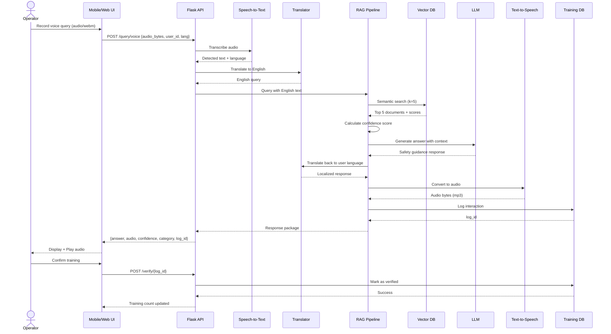
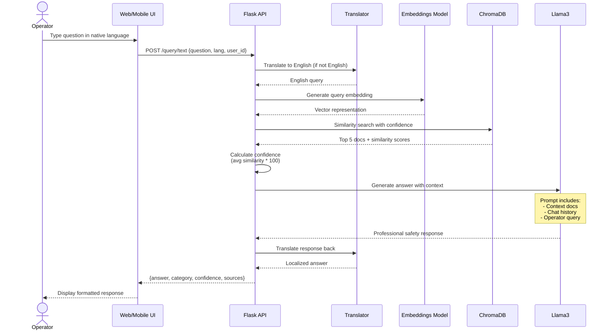
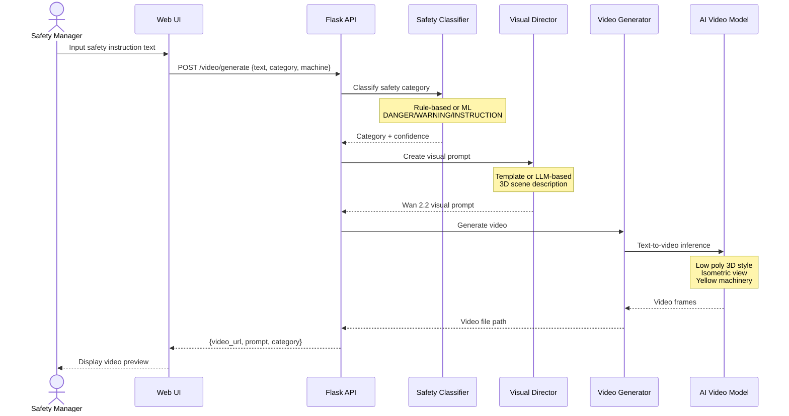
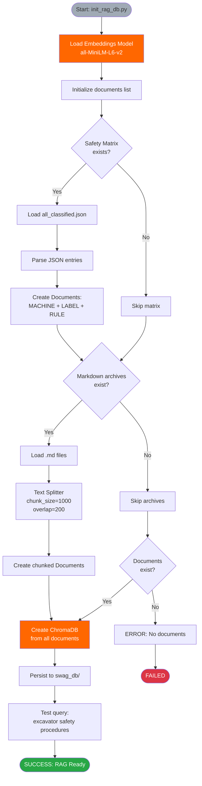
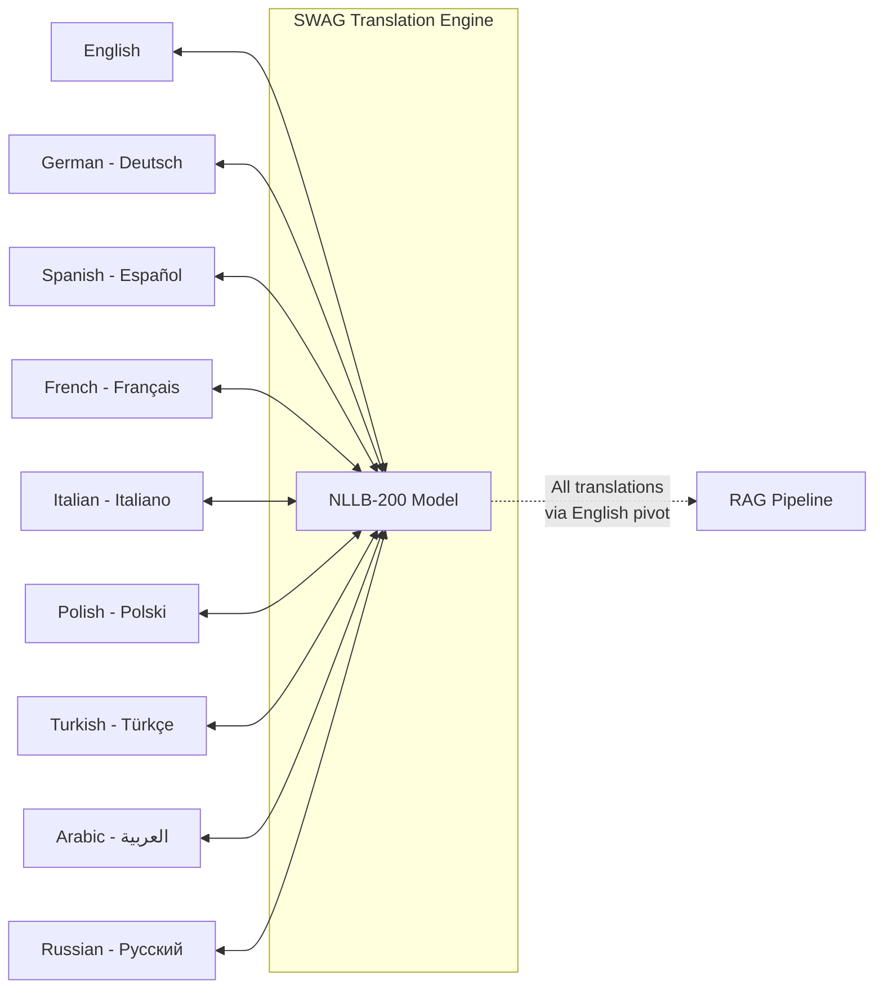
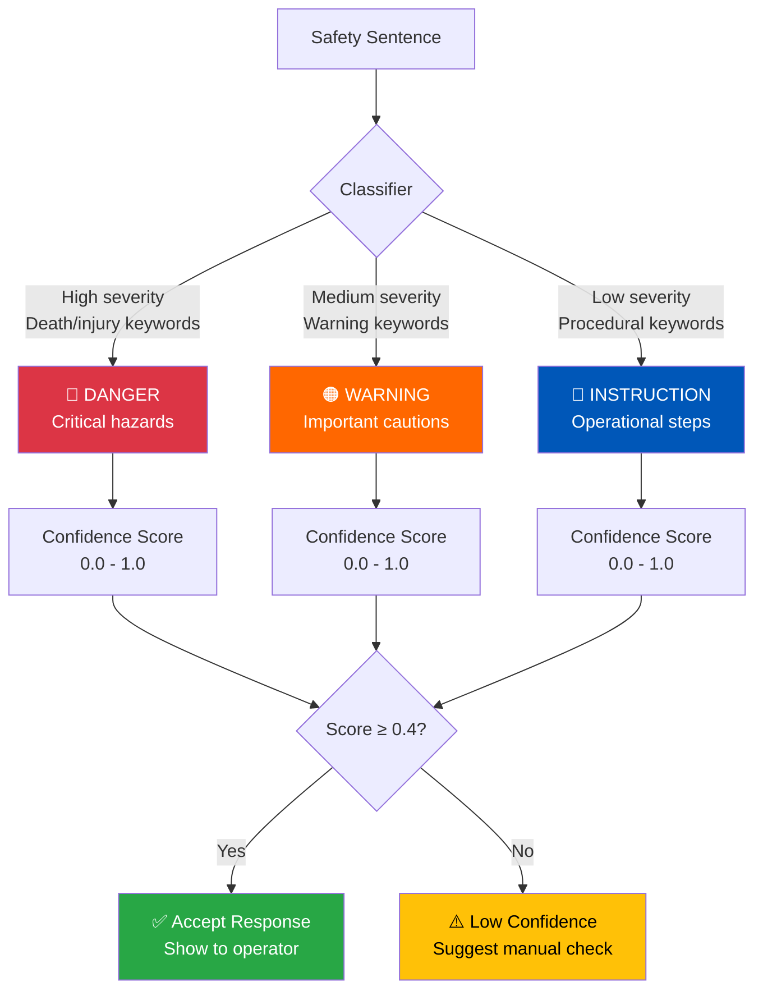
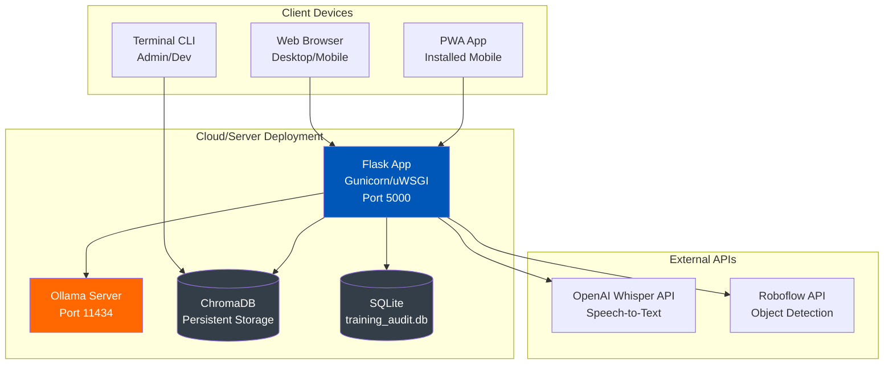

# SWAG System Architecture Design

## Overview

**SWAG (Safe Walk Augmented Generation)** is a comprehensive AI-powered safety intelligence system for heavy machinery operations. It combines multi-modal AI (speech, text, vision) with a RAG (Retrieval-Augmented Generation) pipeline to provide multilingual safety guidance for industrial equipment operators.

---

## System Architecture Diagram



---

## Data Flow Diagrams

### 1. Voice Query Processing Flow



### 2. Text Query Processing Flow



### 3. Safety Video Generation Flow



### 4. Knowledge Base Initialization Flow



---

## Component Architecture

### Core Components

#### 1. **Flask REST API** (`app.py`)
- **Purpose**: Central backend server for all SWAG interfaces
- **Port**: 5000
- **Key Routes**:
  - `GET /` - Serve HTML UI
  - `POST /login` - User authentication
  - `POST /query/text` - Text query processing
  - `POST /query/voice` - Voice query processing
  - `POST /detect` - Object detection (Roboflow)
  - `POST /video/generate` - Safety video generation
  - `POST /verify/<log_id>` - Training verification
  - `GET /training/<user_id>` - Training count
- **Features**:
  - CORS enabled for frontend
  - Lazy model loading (cached)
  - Multi-language support (9 languages)
  - Training audit logging

#### 2. **Mobile PWA** (`swag_app.py`)
- **Framework**: Streamlit
- **Purpose**: Touch-optimized mobile interface
- **Features**:
  - Large touch buttons (80px min height)
  - Voice recording with visual feedback
  - Multi-language selector
  - Training progress tracking
  - Offline PWA capabilities
  - Custom CSS with safety color palette

#### 3. **Terminal CLI** (`swag_core.py`)
- **Purpose**: Developer/admin command-line interface
- **Features**:
  - Direct RAG pipeline access
  - Chat history management
  - Source citation display
  - Military-grade professional responses
  - Color-coded terminal UI (Rich library)

#### 4. **Safety Intelligence Pipeline** (`pipeline/`)

##### a. **Classifier** (`classifier.py`)
- **Purpose**: Categorize safety sentences into 3 types
- **Categories**:
  - `DANGER` - Critical hazards, death/injury risk
  - `WARNING` - Important cautions, damage risk
  - `INSTRUCTION` - Operational procedures
- **Methods**:
  - **Rule-based**: Multi-factor sentiment analysis
    - Keyword density scoring
    - Severity assessment
    - Imperative language detection
    - Urgency and specificity bonuses
  - **ML-based**: Zero-shot classification (BART)
- **Output**: Category + confidence score

##### b. **Visual Director** (`director.py`)
- **Purpose**: Convert safety text → visual prompts for video generation
- **Methods**:
  - **Template-based**: Fast, offline, structured prompts
  - **LLM-based**: Creative prompts via Ollama
- **Style Rules**:
  - Low poly 3D Blender renders
  - Isometric view, minimalist white background
  - Yellow heavy machinery
  - Orange crash test dummies
  - Holographic UI elements
- **Output**: Wan 2.2 compatible video generation prompts

##### c. **Video Generator** (`swag_video.py`)
- **Purpose**: Generate safety training videos from prompts
- **Technology**: Diffusers library (Hugging Face)
- **Model**: Wan 2.2 text-to-video
- **Output**: MP4 safety demonstration videos

---

## AI Models & Technologies

### Speech & Audio
| Component | Model/Library | Purpose |
|-----------|---------------|---------|
| Speech-to-Text | OpenAI Whisper API (cloud)<br/>faster-whisper (local) | Transcribe operator voice queries |
| Text-to-Speech | gTTS (Google Text-to-Speech) | Generate multilingual audio responses |
| Audio Processing | PyAudio | Microphone input handling |

### Language & Translation
| Component | Model/Library | Purpose |
|-----------|---------------|---------|
| Translation | NLLB-200 (Meta) | Translate 9 languages ↔ English |
| Embeddings | all-MiniLM-L6-v2 (HuggingFace) | Convert text → 384-dim vectors |
| LLM | Llama3 (Ollama) | Generate contextual safety answers |
| Text Splitting | RecursiveCharacterTextSplitter | Chunk documents (1000 chars, 200 overlap) |

### Vision & Video
| Component | Model/Library | Purpose |
|-----------|---------------|---------|
| Object Detection | Roboflow API + YOLO | Detect machinery/hazards in images |
| Video Generation | Wan 2.2 (Diffusers) | Text-to-video for safety demonstrations |
| Classification | BART-large-mnli (HuggingFace) | Zero-shot safety categorization |

### Data Storage
| Component | Technology | Purpose |
|-----------|------------|---------|
| Vector Database | ChromaDB | Semantic similarity search for RAG |
| Training Audit | SQLite | Track user queries & verified training |
| Knowledge Base | JSON + Markdown | Safety rules and manual archives |

---

## Supported Languages



**Translation Flow**: User Language → English → RAG → English → User Language

---

## Safety Categories & Confidence Scoring

### Category Definitions



### Confidence Calculation

**Rule-Based Classifier**:
```
confidence = weighted_average(
    keyword_density,      # 40% weight
    severity_score,       # 30% weight
    imperative_score      # 30% weight
) + urgency_bonus + specificity_bonus
```

**RAG Pipeline**:
```
confidence = average(top_5_similarity_scores) * 100
threshold = 0.4 (40%)
```

---

## Technology Stack Summary

### Backend
- **Python 3.x**
- **Flask 3.0+** - REST API server
- **Streamlit 1.30+** - Mobile PWA framework
- **SQLite** - Training audit database

### AI/ML Libraries
- **LangChain 0.1+** - RAG orchestration framework
- **ChromaDB 0.4+** - Vector database
- **Transformers 4.40+** - HuggingFace models
- **faster-whisper 1.0+** - Local STT
- **Ollama 0.2+** - Local LLM inference
- **sentence-transformers 2.6+** - Embeddings
- **Diffusers** - Video generation

### Frontend
- **HTML5/CSS3/JavaScript** - Web UI
- **Web Audio API** - Audio recording/playback
- **Fetch API** - REST client

### DevOps
- **PyTorch 2.2+** (CPU optimized)
- **NumPy** - Numerical computing
- **Rich** - Terminal UI formatting
- **tqdm** - Progress bars

---

## Deployment Architecture



---

## Design Patterns & Principles

### 1. **Lazy Loading Pattern**
- Models loaded on first request, then cached
- Reduces startup time
- Optimizes memory usage

### 2. **Multi-Modal Interface**
- Single backend serving multiple frontends
- Consistent API across CLI, Web, Mobile
- Shared business logic

### 3. **RAG Pipeline**
- Retrieval: ChromaDB semantic search
- Augmentation: Context injection into prompts
- Generation: Llama3 with grounded responses

### 4. **Confidence-Based Responses**
- All answers include confidence scores
- Threshold filtering (40%)
- User verification for low-confidence queries

### 5. **Training Feedback Loop**
- Operators verify responses
- Logged interactions improve system
- Gamification (training count tracking)

### 6. **Multilingual First**
- Translation at boundaries (input/output)
- English as internal processing language
- Consistent experience across languages

---

## File Structure

```
SWAG/
├── app.py                      # Flask REST API (main backend)
├── swag_app.py                 # Streamlit Mobile PWA
├── swag_core.py                # Terminal CLI
├── swag_ui.html                # Web UI (66KB single file)
├── init_rag_db.py              # Vector DB initializer
├── requirements.txt            # Python dependencies
├── training_audit.db           # SQLite database
│
├── pipeline/                   # Safety Intelligence Pipeline
│   ├── __init__.py
│   ├── classifier.py           # Category classification
│   ├── director.py             # Visual prompt generation
│   ├── ingestion.py            # Document processing
│   └── main.py                 # Pipeline orchestration
│
├── output/                     # Generated data
│   ├── classified/
│   │   └── all_classified.json # Categorized safety rules
│   └── markdown/               # Safety manual archives
│
└── swag_db/                    # ChromaDB vector database
    └── [vector data]
```

---

## Security & Privacy

### Data Handling
- **Local Processing**: Most AI runs on local hardware (Ollama, Whisper)
- **Cloud APIs**: OpenAI Whisper (optional), Roboflow (images only)
- **No PII Storage**: User IDs are pseudonymous operator codes
- **Audit Trail**: All queries logged for compliance

### Authentication
- Simple operator ID login (no passwords)
- Session-based tracking
- Training verification system

---

## Performance Considerations

### Optimization Strategies
1. **Model Caching**: In-memory storage of loaded models
2. **CPU-Optimized PyTorch**: Uses CPU wheel for smaller footprint
3. **Lazy Loading**: Models loaded only when needed
4. **Batch Processing**: Classifier supports batch inference
5. **Chunking**: Documents split for efficient retrieval
6. **Index Persistence**: ChromaDB persists to disk

### Resource Requirements
- **RAM**: 8GB+ recommended (models in memory)
- **Storage**: 5GB+ (models + vector DB)
- **CPU**: Multi-core for faster inference
- **GPU**: Optional (significantly speeds up video generation)

---

## Future Enhancements

### Planned Features
- [ ] Fine-tuned safety classification model (SetFit)
- [ ] Real-time video object detection
- [ ] Offline mode (full local processing)
- [ ] Multi-user authentication system
- [ ] Advanced analytics dashboard
- [ ] Integration with machinery IoT sensors
- [ ] AR overlay for safety instructions

---

## Color Palette (Brand Identity)

| Color Name | Hex Code | Usage |
|------------|----------|-------|
| Concrete Mist | `#F0F2F5` | Backgrounds, light surfaces |
| Carbon Steel | `#333E48` | Dark backgrounds, text |
| Safety Orange | `#FF6700` | Warnings, CTAs, highlights |
| Trust Cobalt | `#0057B8` | Primary actions, links |
| Brushed Aluminum | `#A0AAB5` | Secondary elements, borders |

---

## Conclusion

SWAG is a production-ready, enterprise-grade safety intelligence system that combines:
- **Multi-modal AI** (voice, text, vision)
- **Multilingual support** (9 languages)
- **Context-aware responses** (RAG pipeline)
- **Safety-focused design** (confidence scoring, categorization)
- **Flexible deployment** (API, PWA, CLI, Web)

The architecture is modular, scalable, and designed for industrial environments where accuracy and reliability are critical.
